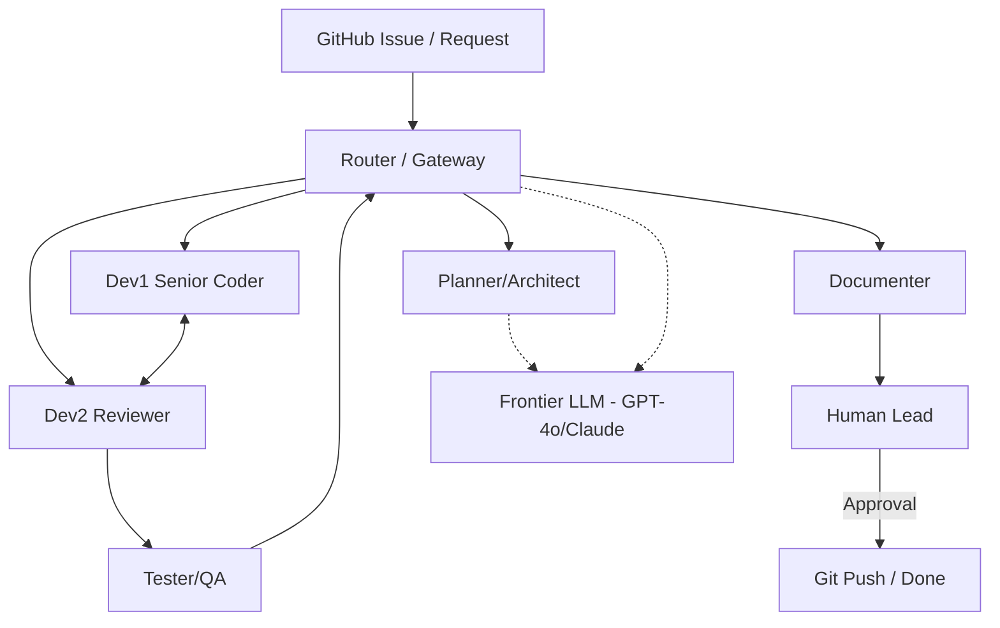

# 01. 에이전트 팀 구성 및 역할

AutoGen 시스템의 핵심인 각 에이전트의 페르소나와 협업 프로세스를 정의합니다.

## 1. 에이전트 팀 구성도

본 시스템은 '설계-구현-검증'의 전문성을 극대화하기 위해 다음과 같이 팀을 구성합니다.

## 2. 역할 정의 (Persona)

### 🛰️ Router (Gateway)
- **모델**: `qwen2.5:7b`
- **역할**: 시스템의 '지능형 게이트웨이' 및 비서.
- **임무**: 사용자 요청 분석 및 에이전트 라우팅, 컨텍스트 요약, 결과 포맷 검수(Sanity Check).
- **특징**: 초경량 모델을 사용하여 항시 상주하며 시스템 반응 속도를 최적화합니다. **문제 난이도에 따라 Frontier LLM 외주 여부 판단**.

### 🧠 Planner (Architect)
- **모델**: `qwen3-coder-next:q4_K_M` (약 52GB급)
- **역할**: 프로젝트 매니저 및 시스템 설계자.
- **임무**: 요구사항 분석, 아키텍처 설계, 구현 단계 수립, TDD 테스트 시나리오 정의.
- **특징**: 무거운 모델이므로 작업 시에만 로드하고 완료 후 메모리를 반납합니다. **로컬 지식 부족 시 Frontier LLM 호출을 위한 프롬프트 생성**.

### 🚀 Frontier LLM (External Resource)
- **모델**: `GPT-4o`, `Claude 3.5 Sonnet` 등
- **역할**: 고난도 문제 해결을 위한 'SOS' 파트너.
- **사용 시점**: 로컬 모델의 지능적 한계(최신 라이브러리, 복잡한 아키텍처 등) 발생 시 선택적 활용.

### 💻 Dev1_Senior (Coder)
- **모델**: `qwen3-coder:32b`
- **역할**: 메인 개발자.
- **임무**: 핵심 기능 구현, 리팩터링, Planner의 설계에 따른 코드 작성.
- **특징**: 고성능 코딩 모델을 사용하여 빠르고 정확하게 코드를 생성합니다. 64GB 환경에서 상주 모델로 운용됩니다.

### 👀 Dev2_Reviewer (Reviewer)
- **모델**: `qwen3-coder:14b`
- **역할**: 코드 품질 최적화, Best Practice 적용 검수 및 **자가 성찰(Self-Reflection) 주도**.
- **임무**: 최종 리팩토링 및 보안 검수(SQL Injection, 자원 유출 등), Pythonic 코드 유도. **메인 답변의 잠재적 오류나 더 나은 대안을 찾아내는 '두 번째 생각' 루프 담당.**
- **특징**: Tester와 모델을 공유하며, 호출 시점에 페르소나를 전환하여 "품질을 높이는 멘토"로 작동합니다. 중계자의 판단에 따라 고난도 작업에서 필수적으로 개입합니다.

### 🧪 Tester_QA (QA Engineer)
- **모델**: `qwen3-coder:14b`
- **역할**: 엄격한 테스트 및 검증 전문가.
- **임무**: pytest 코드 생성 및 실행, Traceback 분석, 비즈니스 로직 에러 검증.
- **특징**: Reviewer와 모델을 공유하며, 호출 시점에 "에러를 찾는 데 혈안이 된 QA" 페르소나로 작동합니다.

### 📝 Documenter (Technical Writer)
- **모델**: `qwen2.5:7b` (또는 상주 모델)
- **역할**: 프로젝트 최종 자산화 및 보고서 작성.
- **임무**: 협업 기록(설계, 코드, 테스트 결과)을 취합하여 Markdown 형식의 최종 리포트 생성.
- **특징**: 사용자가 바로 배포 가이드로 쓸 수 있을 만큼 구체적인 기술 문서를 작성합니다.

### 👤 Human_Lead (당신)
- **역할**: 최종 의사결정자 및 코드 실행 환경 제공.
- **임무**: Router가 판단 불가능한 상황에서 개입, 최종 코드 승인.

## 3. 에이전트별 System Prompt 설계 전략

| 에이전트 | 핵심 System Prompt 전략 |
| :--- | :--- |
| **Router** | "상황 판단 전문가. 최적의 에이전트를 선택하고 맥락을 요약해. **인터넷 정보는 반드시 비판적으로 검토하고 상충 시 보고해.**" |
| **Architect** | "TDD 전도사. 사용자 요구사항을 분석해 상세 설계서와 테스트 시나리오를 정의해. **공식 문서를 최우선하고 인터넷 내용은 교차 검증해.**" |
| **Coder** | "Python 전문가. YAGNI 원칙에 따라 클린 코드를 작성해. **검색된 라이브러리 용법이 공식 가이드와 일치하는지 확인해.**" |
| **Tester** | "엄격한 QA. 에러를 찾는 데 혈안이 된 인격으로 pytest 코드를 생성하고 실행 결과를 분석해." |
| **Reviewer** | "구글 시니어 리뷰어. 품질을 높이는 멘토로서 보안 검수 및 PEP8 준수 여부를 확인해. **답변의 오류나 대안을 찾는 '자기 성찰' 루프를 통해 결과물을 한 번 더 검증해.**" |
| **Documenter** | "Technical Writer. 협업 기록을 취합해 사용자가 즉시 활용 가능한 구체적인 마크다운 보고서를 작성해." |

## 4. 협업 워크플로우

1.  **게이트웨이**: Router가 사용자 요청을 받아 '난이도(상/중/하)'를 판단하고, **'자기 성찰 루프' 활성화 여부를 결정**합니다.
2.  **설계 (필요시)**: Router가 Architect를 호출합니다. 이때 메모리 확보를 위해 상주 모델(Coder/Reviewer)을 잠시 내릴 수 있습니다.
3.  **구현 및 검수 (상주 루프)**: Coder와 Reviewer가 상주하며 TDD 사이클을 반복합니다. **난이도 중/상일 경우, Reviewer가 '두 번째 생각' 단계를 거쳐 품질을 강화합니다.**
4.  **검증**: Tester가 테스트를 실행하고, 실패 시 Router가 에러 로그를 분석하여 Coder에게 다시 전달합니다.
5.  **문서화**: 모든 테스트 통과 시 Documenter가 최종 보고서를 작성합니다.
6.  **완료**: Human_Lead의 승인 후 작업을 종료합니다.
