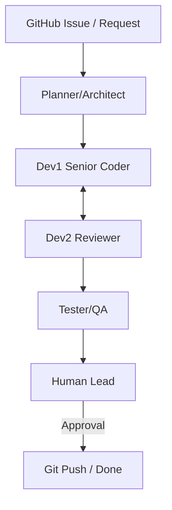

# 01. 에이전트 팀 구성 및 역할

AutoGen 시스템의 핵심인 각 에이전트의 페르소나와 협업 프로세스를 정의합니다.

## 1. 에이전트 팀 구성도

본 시스템은 '설계-구현-검증'의 전문성을 극대화하기 위해 다음과 같이 팀을 구성합니다.

## 2. 역할 정의 (Persona)

### 🧠 Planner (Architect)
- **모델**: `qwen3-coder-next:q4_K_M`
- **역할**: 프로젝트 매니저 및 시스템 설계자.
- **임무**: 요구사항 분석, 아키텍처 설계, 구현 단계 수립, TDD 테스트 시나리오 정의.
- **특징**: 256K 컨텍스트를 활용해 전체 코드베이스의 일관성을 유지합니다.

### 💻 Dev1_Senior (Coder)
- **모델**: `qwen3-coder:32b`
- **역할**: 메인 개발자.
- **임무**: 핵심 기능 구현, 리팩터링, Planner의 설계에 따른 코드 작성.
- **특징**: 고성능 코딩 모델을 사용하여 빠르고 정확하게 코드를 생성합니다.

### 👀 Dev2_Reviewer (Reviewer)
- **모델**: `qwen3:14b`
- **역할**: 코드 리뷰 전문가.
- **임무**: Dev1의 코드 분석, 보안/성능 문제 지적, Best Practice 적용 여부 확인.
- **특징**: 개발자와 다른 시각에서 코드의 결함을 찾아냅니다.

### 🧪 Tester_QA (QA Engineer)
- **모델**: `qwen3:14b` (또는 Coder와 공유)
- **역할**: 테스트 및 배포 담당자.
- **임무**: 유닛 테스트 실행(pytest), 버그 추적, 최종 검증 보고.
- **특징**: 실제 환경에서 코드를 실행하고 에러 발생 시 개발팀에 피드백을 줍니다.

### 👤 Human_Lead (당신)
- **역할**: 최종 의사결정자 및 코드 실행 환경 제공.
- **임무**: 에이전트의 중대한 질문에 답하기, 최종 코드 승인.

## 3. 협업 워크플로우

1.  **시작**: 사용자가 GitHub 이슈나 메시지로 작업을 요청합니다.
2.  **설계**: Planner가 전체 계획과 TDD 시나리오를 작성합니다.
3.  **구현**: Dev1이 코드를 작성합니다.
4.  **검수**: Dev2가 코드를 리뷰하고, 필요시 Dev1에게 수정을 요청합니다.
5.  **검증**: Tester가 테스트 코드를 실행하여 성공 여부를 확인합니다.
6.  **완료**: 모든 검증이 끝나면 Human_Lead의 최종 승인을 거쳐 작업을 완료합니다.
